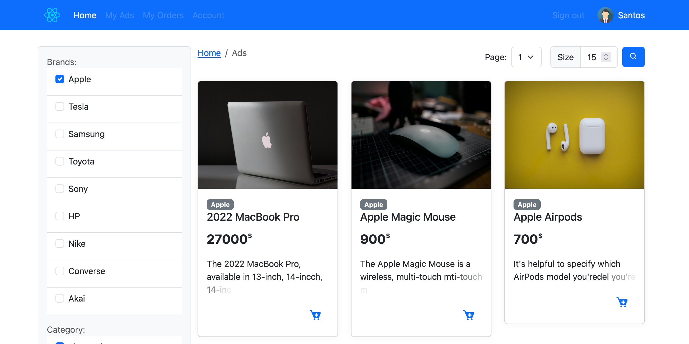

# Aseda E-commerce

Aseda E-commerce is a web application built with React and TypeScript. It provides a platform for users to browse and purchase products, manage their cart, and place orders. The application includes features such as filtering and sorting products, managing user profiles, and handling orders.

## Features

- **Product Listing**: Browse and search for products.

- **Filtering and Sorting**: Filter products by categories, brands, and other criteria. Sort products by price, date, etc.

- **Cart Management**: Add products to the cart, view cart items, and remove items from the cart.

- **Order Management**: Place orders, view order history, and manage addresses.

- **User Profile**: Manage user profile information and addresses.


## Technologies Used

- **React**: A JavaScript library for building user interfaces.
- **TypeScript**: A typed superset of JavaScript that compiles to plain JavaScript.
- **React Bootstrap**: A library of reusable front-end components.
- **SweetAlert2**: A library for creating beautiful, responsive, customizable, and accessible (WAI-ARIA) replacement for JavaScript's popup boxes.
- **DataTables**: A plug-in for the jQuery JavaScript library that adds advanced interaction controls to HTML tables.

## Installation

1. Clone the repository:
    ```bash
    git clone https://github.com/Nabanyi/asedaecommerce-fronted.git
    cd asedaecommerce
    ```

2. Install the dependencies:
    ```bash
    npm install
    ```

3. Start the development server:
    ```bash
    npm start
    ```

## Project Structure

- **src/components**: Contains reusable React components.
- **src/pages**: Contains the main pages of the application.
- **src/utils**: Contains utility functions and helpers.
- **src/styles**: Contains CSS and styling files.

## Contributing

Contributions are welcome! Please fork the repository and create a pull request with your changes.

## License

This project is licensed under the MIT License.